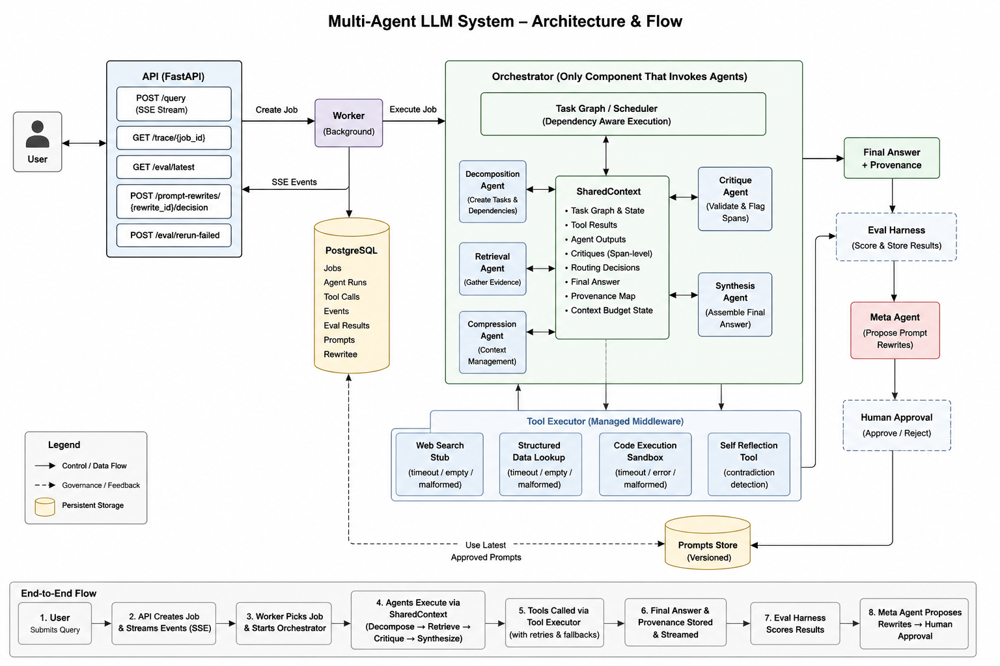

# Real-Time Multi-Agent LLM Orchestration and Evaluation System

This repository implements a containerized multi-agent system with dynamic routing, tool failure contracts, context budget enforcement, an evaluation harness, prompt rewrite approvals, SSE streaming, and queryable execution traces.

The implementation is intentionally deterministic: no external LLM key is required, so a reviewer can run it in a few minutes and diff eval output across runs. The agent interfaces, context discipline, logging, and prompt-improvement workflow mirror a production LLM system while keeping the model behavior inspectable.

## Quick Start

```bash
docker compose up --build
```

Services:

- API: `http://localhost:8000`
- Log query UI: `http://localhost:8080` using Adminer. Server is `db`, database/user default to the env values in `.env.example`.
- Worker: polls queued jobs and runs the eval harness once on first startup when `RUN_EVAL_ON_START=true`.
- Database: PostgreSQL 16.

No credentials are hardcoded. The development compose file uses PostgreSQL trust auth by default. For production-like runs, set `DATABASE_URL`, `POSTGRES_USER`, `POSTGRES_DB`, and a secure PostgreSQL auth method through environment variables.

Local development:

```bash
python -m venv .venv
. .venv/Scripts/activate
pip install -e ".[dev]"
python -m app.run_eval
uvicorn app.main:app --reload
python -m app.worker
```

## API

Exactly five application endpoints are exposed. FastAPI's built-in docs route is disabled to keep the API surface explicit.

### `POST /query`

Submits a query and returns a Server-Sent Events stream. The stream includes `routing_decision`, `agent_started`, `stream_token`, `tool_call`, `agent_completed`, and terminal job events.

Request:

```json
{"query": "What is the capital of France?"}
```
### Example Request (curl)

```bash
curl -N -X POST http://localhost:8000/query \
-H "Content-Type: application/json" \
-d '{"query":"What is the capital of France?"}'
```

> Windows PowerShell users may need to use `curl.exe` instead of `curl`.

### PowerShell Example (Windows)

```powershell
Invoke-RestMethod -Method POST `
  -Uri "http://localhost:8000/query" `
  -ContentType "application/json" `
  -Body '{"query":"What is the capital of France?"}'
```

### Example SSE Stream

```text
event: routing_decision
data: {"next_agent":"retrieval","reason":"dependency resolved"}

event: agent_started
data: {"agent_id":"retrieval","budget_remaining":1200}

event: tool_call
data: {"tool_name":"web_search_stub","attempt":1,"accepted":true}

event: agent_completed
data: {"agent_id":"retrieval","token_count":148}

event: job_completed
data: {"final_answer":"The capital of France is Paris."}
```

The `/query` endpoint streams structured execution events in real time, allowing reviewers to inspect orchestration behavior, routing decisions, tool execution, retries, critique flow, and final synthesis as the job progresses.

### `GET /trace/{job_id}`

Returns the ordered execution trace for a job: structured events, tool calls, exact prompts sent to agents, exact outputs, token counts, hashes, latencies, and policy violations.

### `GET /eval/latest`

Returns the most recent eval summary broken down by category and dimension.

### `POST /prompt-rewrites/{rewrite_id}/decision`

Approves or rejects a pending meta-agent prompt rewrite.

```json
{"decision": "approve", "reason": "Improves citation gating."}
```

### `POST /eval/rerun-failed`

Runs a targeted eval on the latest failed cases using the latest approved prompts and stores performance deltas against the source eval run.

All error responses use:

```json
{"error_code": "machine_readable_code", "message": "Human readable message.", "job_id": "job_id_if_applicable"}
```

## Architecture



See [docs/architecture.md](docs/architecture.md) for the detailed Mermaid flow diagram.

The orchestrator is the only component that invokes agents. Agents never call each other. All handoffs go through `SharedContext`, which carries the task graph, tool results, agent outputs, critique spans, routing decisions, final answer, and sentence-level provenance.

## End-to-End Flow

```text
1. User submits query
        ↓
2. FastAPI API receives request
        ↓
3. API creates Job in PostgreSQL
        ↓
4. Worker picks queued job
        ↓
5. Orchestrator initializes SharedContext
        ↓
6. Decomposition Agent creates tasks + dependencies
        ↓
7. Retrieval Agent gathers evidence using ToolExecutor
        ↓
8. ToolExecutor manages:
      - web search
      - structured lookup
      - code sandbox
      - retries/fallbacks
        ↓
9. Critique Agent validates claims
      - detects contradictions
      - checks grounding
      - flags unsafe spans
        ↓
10. Synthesis Agent assembles only approved claims
        ↓
11. Final answer + provenance map generated
        ↓
12. SSE events streamed back to client
        ↓
13. Eval Harness scores:
      - correctness
      - grounding
      - efficiency
      - robustness
        ↓
14. Meta-Agent proposes prompt rewrites
        ↓
15. Human approves/rejects rewrites
```

## Agents

- Decomposition agent: turns ambiguous input into typed subtasks and dependency edges. It marks assumption tasks resolved and leaves dependent tasks pending until prerequisites complete.
- Retrieval agent: uses the tool executor for search, structured lookup, code execution, and explicit fallback. Retrieval answers cite at least two chunks when chunk retrieval is used.
- Critique agent: reviews each prior output at claim/span level, assigns confidence, flags specific spans, and calls self-reflection for contradictions.
- Synthesis agent: merges accepted claims, removes disputed spans, resolves false premises, and emits a provenance map for every final sentence.
- Compression agent: invoked by the context manager before budget overflow. It preserves structured artifacts exactly and compresses only conversational filler.
- Meta-agent: reads eval failures and stores a proposed prompt rewrite with a structured diff. It never applies the rewrite automatically.

## Tools And Failure Contracts

The `ToolExecutor` logs every call with input, output, latency, attempt number, and accept/reject status. Rejected outputs are retried up to two times with modified input.

- `web_search_stub`: returns `{chunk_id, url, snippet, relevance_score}`. Failure modes: `timeout`, `empty`, `malformed`.
- `code_execution_sandbox`: runs isolated Python snippets and returns stdout, stderr, and exit code. Failure modes: `timeout`, `malformed`, `error`.
- `structured_data_lookup`: converts natural language to safe SQL over `structured_facts`. Failure modes: `timeout`, `empty`, `malformed`.
- `self_reflection`: rereads session outputs and reports contradictions. Failure modes: `empty`, `malformed`.

Fallback logic is implemented in Python, not prompt text: timeout broadens timeout, empty broadens the query or falls back to another tool, and malformed input is sanitized before retry.

## Evaluation

`app.eval_harness.TEST_CASES` contains 15 cases:

- Five baseline factual/math questions.
- Five ambiguous or underspecified questions.
- Five adversarial questions covering prompt injection, false premises, and contradiction resolution.

Each case receives numeric scores plus justification strings for:

- answer correctness
- citation accuracy
- contradiction resolution quality
- tool selection efficiency
- context budget compliance
- critique agreement with final output

Every eval run stores exact prompts, tool calls, outputs, scores, timestamps, and job traces in the database. Because the system is deterministic, reruns are diff-able.

## Data Handling, Leakage, And Baselines

The local corpus is seeded into `knowledge_chunks` and `structured_facts`. Agents can retrieve from those tables, but eval expectations are only used after a job completes inside scoring code. Prompt rewrites are proposed from failure summaries and require human approval before affecting future runs.

The baseline is a deterministic retrieval-and-lookup system. The extra orchestration complexity is only used where the task requires it: ambiguous decomposition, span-level critique, context-budget policy, and auditable prompt improvement.

## Why Deterministic Instead of Real LLM APIs?

The system intentionally uses deterministic agent behavior instead of external LLM APIs so the project can be:

- reproducible across runs
- executable without paid API credentials
- diff-able during evaluation reruns
- inspectable during orchestration and critique analysis
- runnable in a few minutes by reviewers

The project focuses on production-style architecture boundaries rather than model capability itself.  
The orchestration layer, shared context system, tool middleware, critique pipeline, provenance tracking, evaluation harness, and prompt-governance workflow are designed so real LLM adapters can be integrated later without changing the overall system architecture.

This approach prioritizes:
- observability
- reproducibility
- deterministic evaluation
- debugging transparency
- architectural clarity

## Known Limitations

- Agent reasoning behavior is deterministic and rule-based so the assessment runs without paid model credentials. Swapping in a real model would keep the same agent, tool, context, and logging boundaries.
- The Python sandbox uses process isolation and static checks, not a hardened container-per-call jail.
- The search tool is a structured local stub, not internet search.
- Token counting is approximate and intentionally conservative.
- The NL-to-SQL translator supports a safe, small grammar over the seeded fact table.

## AI Assistance Disclosure

AI-assisted development tools, primarily OpenAI Codex and ChatGPT, were used during implementation to accelerate scaffolding, boilerplate generation, architecture iteration, debugging assistance, and documentation refinement.

All generated code and documentation were manually reviewed, executed, validated, and iteratively refined before submission. The orchestration flow, shared context system, critique pipeline, provenance tracking, evaluation harness, retry/fallback middleware, and overall architecture were studied and verified end-to-end during development.

The final repository structure, execution verification, debugging process, architecture understanding, documentation decisions, and submission preparation reflect my own review and understanding of the system.

This disclosure is included intentionally to align with the assessment requirement permitting AI-assisted development with transparent attestation.

## What I Would Build Next

- Add real model adapters behind the agent interfaces with JSON schema validation and retryable parse repair.
- Run code execution in a locked-down Firecracker or gVisor sandbox.
- Add migrations and row-level retention policies for production traces.
- Add a small reviewer UI for prompt rewrite diffs, trace replay, and eval regression comparison.
- Split the eval corpus into development, regression, and holdout sets before allowing any approved prompt to graduate.

