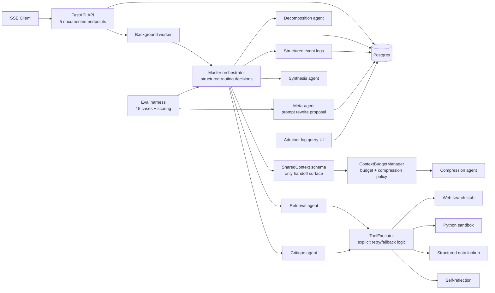

# Architecture Diagram

```mermaid
flowchart LR

  Client["SSE Client"]
    --> API["FastAPI API\n5 documented endpoints"]

  API --> DB[(Postgres)]
  API --> Worker["Background worker"]

  Worker --> DB
  Worker --> Orchestrator["Master orchestrator\nstructured routing decisions"]

  Orchestrator --> Context["SharedContext schema\nonly handoff surface"]

  Context --> Budget["ContextBudgetManager\nbudget + compression policy"]
  Budget --> Compression["Compression agent"]

  Orchestrator --> Decomp["Decomposition agent"]
  Orchestrator --> Retrieval["Retrieval agent"]
  Orchestrator --> Critique["Critique agent"]
  Orchestrator --> Synthesis["Synthesis agent"]

  Retrieval --> Tools["ToolExecutor\nexplicit retry/fallback logic"]
  Critique --> Tools

  Tools --> Web["Web search stub"]
  Tools --> Code["Python sandbox"]
  Tools --> SQL["Structured data lookup"]
  Tools --> Reflect["Self-reflection"]

  Orchestrator --> Logs["Structured event logs"]
  Logs --> DB

  Eval["Eval harness\n15 cases + scoring"]
    --> Orchestrator

  Eval --> Meta["Meta-agent\nprompt rewrite proposal"]

  Meta --> DB

  LogsUI["Adminer log query UI"]
    --> DB
```
